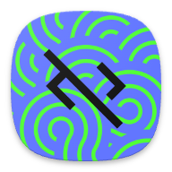

  

  <h1 style="border-bottom: none; margin-bottom: 0; color: #58a6ff; font-size: 3em; font-weight: 800; letter-spacing: -1px; text-transform: uppercase;">LibreCode</h1>
  
The Professional Mobile Agentic Workstation

  

    ANDROID NATIVE
    PYTHON BACKEND
    OPEN SOURCE
  

  LibreCode is a high-performance, autonomous engineering harness built specifically for Android. It bypasses the limitations of Termux and Linux layers by running a native APK frontend integrated with a powerful Python Flask backend. This architecture provides raw device access and desktop-class agentic capabilities in the palm of your hand.

  

    <h3 style="color: #58a6ff; margin-top: 0;">Autonomous Website Analysis</h3>
    
A precision-engineered browser interaction engine. It handles recursive Shadow DOM traversal, identifies elements via smart heuristics (cursor/pointer/tabindex), and offers full visibility into streaming WebSocket and SSE traffic for real-time analysis.

  

  

    <h3 style="color: #58a6ff; margin-top: 0;">Agentic Engineering Workflow</h3>
    
Structured "Plan then Build" cycle. The agent indexes your codebase, generates a verified strategy, and executes surgical patches with your approval—mimicking the workflow of a senior staff engineer.

  

<h2 style="color: #58a6ff; border-bottom: 1px solid #30363d; padding-bottom: 12px; margin-top: 60px; font-size: 1.8em;">Premium Coding Models — Unrestricted and Free</h2>

LibreCode delivers world-class intelligence without subscription fees. Our harness is pre-configured to utilize the most powerful coding models available today, optimized for engineering logic and large-context tasks:

<ul style="list-style: none; padding: 0; display: grid; grid-template-columns: 1fr 1fr; gap: 15px;">
  <li style="background: #21262d; padding: 12px 20px; border-radius: 8px; border-left: 4px solid #58a6ff;"><b>Qwen 3.6 Plus / Max</b> — Architectural Logic</li>
  <li style="background: #21262d; padding: 12px 20px; border-radius: 8px; border-left: 4px solid #3fb950;"><b>MiniMax M2.5</b> — Reliable Reasoning</li>
  <li style="background: #21262d; padding: 12px 20px; border-radius: 8px; border-left: 4px solid #f08b73;"><b>GPT OSS 120B</b> — Massive Intelligence</li>
  <li style="background: #21262d; padding: 12px 20px; border-radius: 8px; border-left: 4px solid #d299ff;"><b>Gemini 3.0 Flash</b> — Low-Latency Cycles</li>
  <li style="background: #21262d; padding: 12px 20px; border-radius: 8px; border-left: 4px solid #e3b341;"><b>Llama 4 Scout</b> — Technical Precision</li>
  <li style="background: #21262d; padding: 12px 20px; border-radius: 8px; border-left: 4px solid #58a6ff;"><b>DeepSeek V3.2</b> — System Programming</li>
</ul>

<h2 style="color: #58a6ff; border-bottom: 1px solid #30363d; padding-bottom: 12px; margin-top: 60px; font-size: 1.8em;">Interaction Infrastructure</h2>

LibreCode's "Vision" goes beyond standard element scraping. It allows the agent to navigate the modern web like a human user:

*   <b>Heuristic Element Detection:</b> Finds clickable buttons and inputs that lack semantic tags by analyzing computed styles.
*   <b>Shadow DOM recursive search:</b> Interacts with components inside React, Lit, and Web Components.
*   <b>Streaming Data Visibility:</b> Intercepts and logs WebSocket and Server-Sent Events (SSE) for real-time app debugging.
*   <b>Native Control Suite:</b> Precision tools for hovering, keyboard shortcuts (Enter, Tab, Escape), and complex multi-page navigation.

<h2 style="color: #58a6ff; border-bottom: 1px solid #30363d; padding-bottom: 12px; margin-top: 60px; font-size: 1.8em;">System Architecture</h2>

*   <b>Native UI:</b> Responsive Android interface running in a privileged WebView environment.
*   <b>Back-end Engine:</b> Local Flask server powered by Chaquopy Python 3.x.
*   <b>Power Tools:</b> Integrated native binaries for ripgrep and fd for ultra-fast codebase indexing.
*   <b>Bridges:</b> Bi-directional Java-to-JavaScript communication for total device and web control.

  LibreCode: The Industry Standard for Mobile-First Agentic Engineering.

